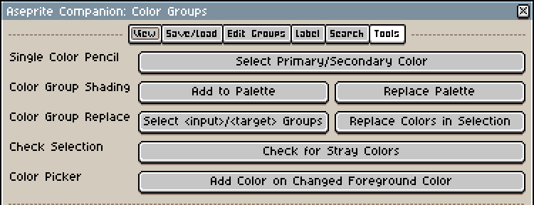

# aseprite companion
This is an aseprite extension that provides additional features for [aseprite](https://www.aseprite.org/).

It provides a color groups dialog for grouping colors and naming color groups and a color shades dialog for the creation
of simple color shade ramps.

# Installation
You can add extensions in the `.zip` file format over `Edit > Preferences... > Extensions > Add Extension`.

[Official aseprite plugin documentation](https://www.aseprite.org/api/plugin).

# Usage
Aseprite companion's dialogs can be found in the menu `Sprite > [Aseprite Companion]`.

I recommend assigning a shortcut to the color groups dialog, e.g. `CTRL + G`.
This can be done over the menu `Edit > Keyboard Shortcuts...`.

`Color Groups` Dialog:

- Paged Color Group List
  - **Selection** button **▲**: Move the color group selection upward. Wraps around.
  - **Selection** button **▼**: Move the color group selection downward. Wraps around.
  - **Pages** button **|<**: Go to the first color group page.
  - **Pages** button **<<**: Go several color group pages back.
  - **Pages** button **<**: Go one color group pages back.
  - **Pages** button **>**: Go one color group pages forward.
  - **Pages** button **>>**: Go several color group pages forward.
  - **Pages** button **>|**: Go to the last color group page.

- Tab **View**
  - Groups per Page
    - With this setting your can change indirectly change the height of the dialog. Depending on your resolution you might want to use more or less color groups that are visible per page. Higher values are worse than lower values regarding performance.
    - Button **<**: decrease the number of shown color groups per page by one, down to a minimum of 1.
    - Button **>**: increase the number of shown color groups per page by one, up to a maximum of 20.
  - **Selector** button **Show / Hide**: show or hide the selection labels and buttons. You can hide them if you are done editing your color groups and want to remove clutter from the dialog.
  - **Labels** button **Show / Hide**: show or hide the labels above the color groups. You can hide them if you are not using labels much to remove clutter from the dialog.

- Tab **Save/Load**
  - Input **File Name**: enter a file name that you want to your color groups to be saved to.
  - Button **Save**: saves your color groups to the entered file name.
  - Button **Load**: loads your color groups from the entered file name.
  - Button **Open Folder**: open your color groups folder. Useful to get an existing file name to load.
  - Button **Reset All Loaded Color Groups**: clears and reset all loaded color groups for a clean start. If this is not sufficient delete (e.g. due to bugs) the `<aseprite>/extensions/aseprite-companion/__pref.lua` file to get a clean slate.

- Tab **Edit Groups**
  - Input **Group Name**: enter a name that you want to set a group's name to.
  - Button **Rename Group**: renames the selected group to the given name.
  - Button **Add Colors**: adds selected colors from the active palette to the selected group.
  - Button **Clear Colors**: clears all colors from selected group.
  - Button **Add Palette of Selected Layers/Cels/Frames**: replaces the selected color group's colors with the ones found in the selected layers/cels/frames.

- Tab **Label**
  - Dropdown **Existing Labels**: lists all existing labels as an overview.
  - Input **Add Label**: enter a label that you would like to add to a group. Whitespace characters are replaced by underscores. Empty labels are not allowed.
  - Button **Add**: adds the entered label to the selected group. 
  - Dropdown **Remove Labels**: lists all labels that the selected group has. Select the label you want to remove here.
  - Button **Remove**: removes the selected label from the selected group.

- Tab **Search**
  - Dropdown **Existing Labels**: lists all existing labels as an overview.
  - Input **All of (AND)**: enter multiple labels by separating them with a space by which you want to filter the groups. All of these labels must be present in a group for that group to be shown.
  - Input **Any of (OR)**: enter multiple labels by separating them with a space by which you want to filter the groups. At least one of these labels must be present in a group for that group to be shown.
  - Dropdown **Number of Colors**: select the number of colors your want shown groups to have.
  - Button **Search**: search according to the specified search rules. Labels that do not exist or are duplicate within the search label inputs will be removed from their text field, so you can see what really was searched for.
  - Button **Clear Search**: clears the search and shows all color groups.

- Tab **Tools**
  - Button **Select Primary/Secondary Color**
    - This is the active default tool.
    - When clicked: Activates this tool and activates the pencil tool with the simple ink.
    - If active: left/right clicking onto a color group's color will:
      - select the foreground/background color,
      - activate the pencil tool with the simple ink.
  - Button **Add to Palette**
    - When clicked: Activates this tool and activates the pencil tool with the shading ink.
    - If active: clicking onto a color group's color will:
      - add that color group to the active palette,
      - select that range of colors,
      - activate the pencil tool with the shading ink.
  - Button **Replace Palette**
    - When clicked: Activates this tool and activates the pencil tool with the shading ink.
    - If active: clicking onto a color group's color will:
      - replace the active palette with that color group,
      - select that range of colors,
      - activate the pencil tool with the shading ink.
  - Button **Select \<input>/\<target> Groups**
    - When clicked:
      - Activates this tool.
    - If active:
      - left clicking onto a color group's color will set the internal \<input> palette to that color group;
      - right clicking onto a color group's color will set the internal \<target> palette to that color group;
        - the <target> group must have the same amount of colors as the \<input> group;
  - Button **Replace Colors in Selection**
    - When clicked and if the \<input> and \<target> group have previously been selected and the \<target> group has the same amount of colors as the \<input> group:
        - replaces all colors that match the \<input> group's colors in the selected layers/frames/cels, with the colors of the \<target> group. This replacement will be done by the index of the color in both color groups.
  - Button **Check for Stray Colors**
    - When clicked:
      - Activates this tool.
    - If active:
      - clicking onto a color group's color will check if any colors of the selected layers/frames/cels are not within that color group and list their RGBA values if there were any.

# Aseprite Compatibility
The following aseprite versions have been tested successfully for compatibility with this extension:

| aseprite version | tested aseprite companion version        |
|------------------|------------------------------------------|
| 1.3.2            | 2.1.0, 2.0.0, 1.3.0, 1.2.0, 1.1.2, 1.1.1 |
| 1.3-beta4        | 1.1.1, 1.1.0, 1.0.0                      |

If you have another version, this extension might still work, you'll have to try it yourself.

# History
This is a fork of the original [aseprite companion version "1.1.1"](https://joncote.itch.io/aseprite-companion)
with some fixes and changes applied.

The original github repository seems to not be publicly available, since this software is MIT licensed,
I created this one instead.

The older versions are marked via git tags, so if you wanted to you could use any of the older versions.

A big thanks to Jon Cote for their work on this aseprite extension / plugin.

Since there is [Chaonic's Palette Helper](https://chaonic.itch.io/aseprite-palette-helper)
([github](https://github.com/ChaonicTheDeathKitten/Palette-Helper)), I will not extend the `Color Shades` dialog.
However, it won't be removed in case anyone prefers the simpler dialog.

# Changelog
- Ideas
  - shading tool optimization: check if color group is already within the palette to not needlessly grow the palette
    - this is put on halt: more often I use the replace palette mode
  - middle mouse click to remove color from color group
    - this is put on halt: I don't really need that right now
- branch master (to be tag 2.1.0)
  - Removed the `Guide` tab as the explanation was getting to big for the dialog. If you need documentation, refer to the readme document.
  - `Edit Groups` tab:
    - Added button `color retriever`: retrieve palette from all frames of the selected layers/cels/frames. Pixels that are fully transparent (alpha = 255) are ignored.
      - The retrieved colors are automatically sorted: primarily by hue, and brighter colors to the right. Visual pleasing color sorting is difficult, some manual correction might still be necessary.
  - `Tools` tab:
    - Added button **Select \<input>/\<target> Groups**.
    - Added functionality to the `Replace Colors in Selection` button.
    - Added button **Check for Stray Colors**.
- tag 2.0.0
  - `Color Groups` dialog changed:
    - General:
      - Limited concurrently open color groups dialogs to one. If you set up a keyboard shortcut you can easily open/close this dialog whenever you need to, since the most important state is now kept in between dialog closings and openings.
      - Moved the dialogs from the `Sprite` menu into their own `Sprite > [Aseprite Companion]` sub menu.
      - Color group dialogs can now be opened and used without an active sprite. However, adding colors requires an active palette/sprite.
      - Saving and loading plugin preferences for the color groups dialog. Whenever the dialog is opened it loads previous color groups and some other fields and prefills them. This is consistent over aseprite restarts. But please still save your color groups with the save / load mechanism as this preference feature seemed to be a bit more brittle.
      - Reworked color groups dialog layout: tabs are now used for the top section.
      - Changed color group page navigation to accommodate more color groups.
      - Better performance: performance is not (significantly) impaired by the number of color groups anymore.
      - Increased number of color groups to 300.
      - The selection of a active color group for editing changed, because the aseprite plugin API was giving me a hard time with dropdown menus (you can not query the selected index, but only get an index).
    - Added `Guide` tab: moved the description into this tab.
    - Added `View` tab:
      - The number of shown color groups can be chosen within the range of 1 to 20. The default is now 10. You might want to teak this value because of selection performance and / or monitor resolution.
      - Added a button to show/hide the selector display.
      - Added a button to show/hide the label header row display.
    - Added `Save/Load` tab:
      - Breaking Change: the save file format changed from ".lua" to ".json", old save files will have to be recreated from scratch.
      - Breaking Change: the color groups now use the RGBA color values instead of the palette indices, this makes color group usage more portable between sprites and makes palette syncing unnecessary.
      - The file name field is not cleared anymore upon loading of a color group file.
      - Added a button to clear and reset all loaded color groups for a clean start. If this is not sufficient delete (e.g. due to bugs) the `<aseprite>/extensions/aseprite-companion/__pref.lua` file to get a clean slate.
    - Added `Edit Groups` tab:
      - The group name field is not cleared anymore upon color group renaming.
      - Changed layout.
    - Added `Label` tab:
      - Labels can be added and removed to and from color groups. It's a bit clunky, but probably sufficient.
      - A label in this context is a string that has no whitespace characters within. Whitespaces are replaced by underscores.
    - Added `Search` tab:
      - The shown color groups can be filtered according to their labels.
      - A first space separated list of labels can be provided to search for labels that a color group must all have.
      - A second space separated list of labels can be provided to search for labels that a color group must have at least one of.
      - A number of colors can be selected that a coloring group must contain.
      - More formally this expression matches a color group: `num_colors_matches ∧ (and_1 ∧ and_2 ∧ ... ∧ and_N) ∧ (or_1 ∨ or_2 ∨ ... ∨ or_M)`.
    - Added `Tools` tab:
      - Only one tool can be active at the same time. Activate them by clicking on the tool buttons in this tab.
      - Pencil tool `Select Primary/Secondary Color`: the only mode that was present up until tag v2.0.0 - left/right click on a color within a color group sets the foreground/background brush color. A click on this tool button also activates the pencil tool.
      - Shading tool `Add to Palette`: clicking on any color within a color group sets adds the color group to the end of the active palette, selects the color group's colors as in active use for the shading tool and activates the shading tool.
      - Shading tool `Replace Palette`: clicking on any color within a color group replaces the active palette with the color group that was clicked, selects the color group's colors as in active use for the shading tool and activates the shading tool.
- tag v1.3.0
  - Instead of 3 color group pages (with each 10 groups) there are now 10 color group pages
    (with each 10 groups).
    - The page size and group size can now easily be changed in the plugin source code by only changing 1 or 2 variables.
      However larger values lead to bad dialog performance.
  - The color group page number is now displayed within the title of the separator above the color group page
    section.
  - The button "previous" on the first color group page and "next" on the last color group page now wrap around
    instead of staying on the same group page.
- tag v1.2.0
  - Previously left/right clicking a color in a color group both set the foreground color. Now a left click sets
    the foreground color and a right click sets the background color.
- tag v1.1.2
  - Fixed thanks to Eldresh: In Color Groups, when adding colors, the color at the last index in a palette couldn't be
    added. Instead, the color at index 0 is added.
- tag v1.1.1
  - Added "Add Shades to Palette" button.
  - Relabeled "Enable Create Mode" button to "Enable Edit Mode".
- tag v1.1.0
  - Added `Color Groups` dialog:
    - Group your colors and rename them for easy identification and a consistent style.
    - Click on any color in a color group to select it as primary color for drawing.
    - Save/load your color groups as/from external files.
    - A total of 30 color groups on 3 pages are supported.
    - The color groups only save the index of the color into the currently active palette, making it necessary to sync
      ones active palette with the color groups.
      - This was changed in version `2.0.0`.
- tag v1.0.0
  - First release of the aseprite companion.
  - Added `Color Shades` dialog: Quickly create color shade ramps from a selected base color. Some options like hue, saturation and
    lightness are available.
    - If you have more complex needs for creating color shade ramps I suggest you have a look at
      [Chaonic's Palette Helper](https://chaonic.itch.io/aseprite-palette-helper)
      ([github](https://github.com/ChaonicTheDeathKitten/Palette-Helper))
      as this tool has more options to create color shades and palettes.